# AI Instruction Modules: Visual Architecture Diagrams

<xml>
<instructions role="architect" scope="architecture-diagrams">

<diagrams>
This document contains Mermaid diagrams that visualize the comprehensive guides architecture.

## High-Level System Architecture

## Workflow Development Guide Architecture

```mermaid
graph TB
    WG[ai-workflow-development-guide.md<br/>Comprehensive Guide]
    
    WG --> WG1[📑 Purpose & When to Use]
    WG --> WG2[⚡ Quick Reference<br/>DSL Syntax, Events, Orchestrator]
    WG --> WG3[📖 Canonical Reference Files]
    WG --> WG4[🔄 Common Workflows<br/>Create, Add, Orchestrate, Validate]
    WG --> WG5[🔧 Troubleshooting]
    WG --> WG6[💡 Examples]
    WG --> WG7[📝 Summary]
    
    WG3 --> C1[ai-workflow-assignments.md<br/>Assignment Structure & Execution]
    WG3 --> C2[orchestrate-dynamic-workflow.md<br/>Orchestrator Procedures]
    WG3 --> C3[dynamic-workflow-syntax.md<br/>Complete DSL Reference]
    WG3 --> C4[validate-dynamic-workflow-script.md<br/>Validation Procedures]
    
    style WG fill:#d1ecf1,stroke:#0c5460,stroke-width:3px
    style WG1 fill:#fff3cd
    style WG2 fill:#fff3cd
    style WG3 fill:#fff3cd
    style WG4 fill:#fff3cd
    style WG5 fill:#fff3cd
    style WG6 fill:#fff3cd
    style WG7 fill:#fff3cd
    style C1 fill:#d4edda
    style C2 fill:#d4edda
    style C3 fill:#d4edda
    style C4 fill:#d4edda
```

## Application Development Guide Architecture

## Development Environment Guide Architecture

## Information Flow Patterns

### Pattern 1: Quick Reference Lookup

### Pattern 2: Workflow Execution

### Pattern 3: Troubleshooting

### Pattern 4: Deep Dive

## User Journey Maps

### Journey 1: New Developer Onboarding

### Journey 2: Experienced Developer: New Feature

### Journey 3: DevOps Engineer: Workflow Creation

## Hybrid Architecture Benefits

## Content Distribution

## Access Pattern Distribution

## Future Expansion Roadmap

## Summary

These visual diagrams provide multiple perspectives on the comprehensive guides architecture:

1. **Structural Diagrams** - Show relationships between guides and canonical files
2. **Flow Diagrams** - Illustrate information access patterns
3. **Journey Maps** - Show user experiences across different roles
4. **Mind Maps** - Display benefits and features
5. **Distribution Charts** - Show content organization
6. **Timeline** - Show evolution and future plans

All diagrams can be rendered in:
- GitHub (automatic rendering)
- VS Code (with Mermaid extension)
- Mermaid Live Editor (https://mermaid.live)
- Any Mermaid-compatible viewer
</diagrams>
</instructions>
</xml>
